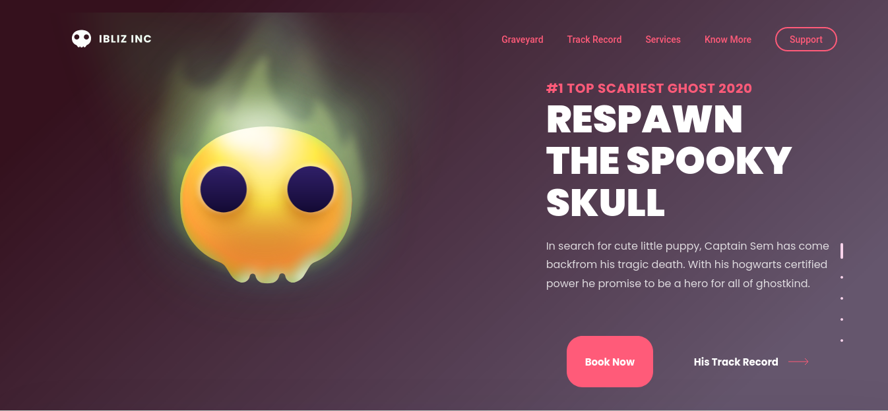
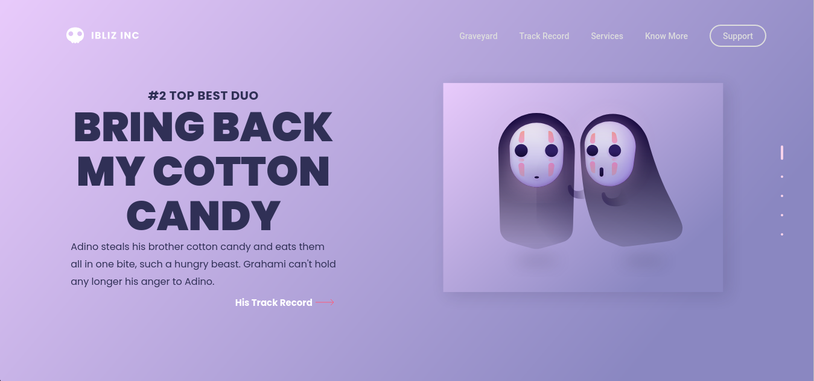
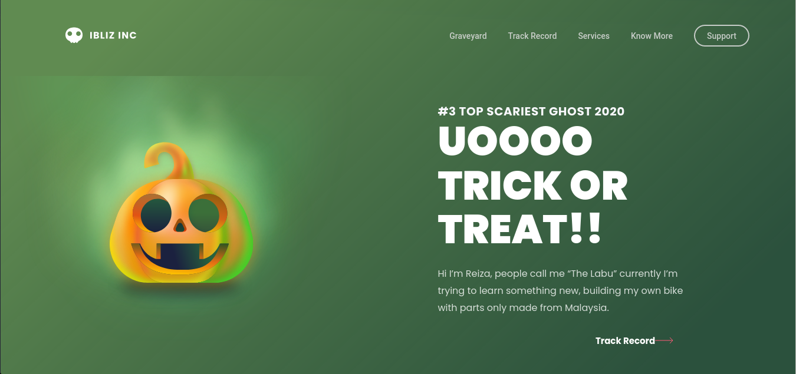

<h1 align="center">Welcome to Hallowen Interface! 🎃👋</h1>
<p>
  
  <a href="LICENSE" target="_blank">
    
  </a>
  <a href="https://twitter.com/andersonarorjdev" target="_blank">
    
  </a>
</p>


<h4>Don't afraid! I don't will kill you!🌝 I just want scare you...😬</h4>


>> Looking on Drible, i found this interface and i think it amazing...💓, so, why don't reproduce it?🤔🚀

## Look this, but, with caution...💣🗡💀
<p align="center">
    
</p>
<p align="center">
    
</p>
<p align="center">
    
</p>

***

## Downloading project ⬇
```sh
  git clone https://github.com/andersonarorjdev/Hallowen-Interface.git
```


## Install the Dependencies 🖥

```sh
yarn install
```

## Starting the server to see the project 👀

```sh
yarn run 
``` 

## Author

👤 **Andersonarorjdev**

* Website: https://andersonarorjdev.github.io
* Twitter: [@andersonarorjdev](https://twitter.com/andersonarorjdev)
* Github: [@andersonarorjdev](https://github.com/andersonarorjdev)
* LinkedIn: [@andersonarorjdev](https://linkedin.com/in/andersonarorjdev)

## Show your support

Give a ⭐️ if this project helped you!

## 📝 License

Copyright © 2020 [Andersonarorjdev](https://github.com/andersonarorjdev).<br />
This project is [MIT](LICENSE) licensed.
